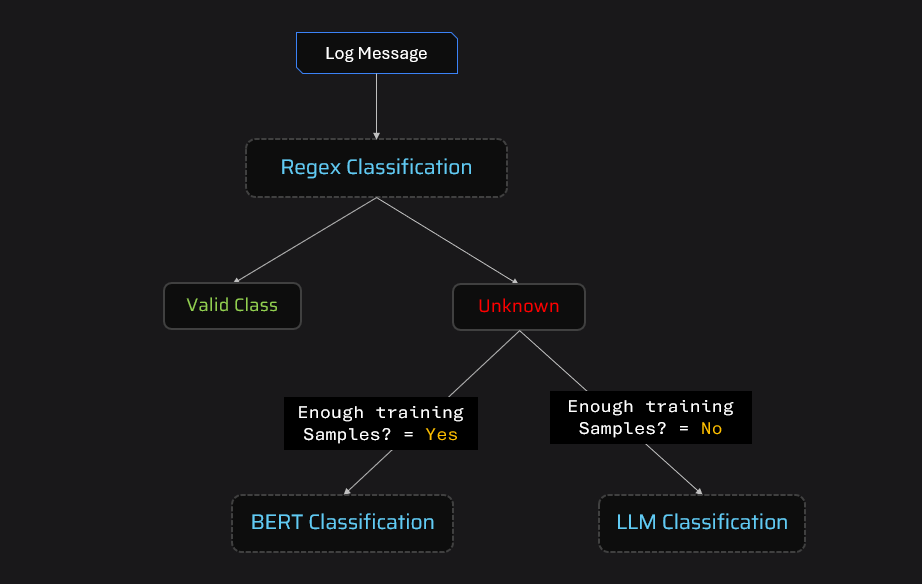

# 🚀 Hybrid Log Classification System (Regex + BERT + LLM)

A production-oriented NLP system that classifies log messages using a **multi-stage hybrid pipeline** combining rule-based methods, machine learning, and large language models.

---

## 📌 Overview

Log data in real-world systems is highly diverse — ranging from structured system logs to unstructured human-written messages. A single model often fails to generalize across all cases.

This project implements a **hierarchical classification pipeline** that balances:

* ⚡ Speed (Regex)
* 🎯 Accuracy (BERT)
* 🧠 Flexibility (LLM)

---

## 🧩 Architecture



### 🔄 Pipeline Flow

1. **Regex Classification**

   * Handles simple, repetitive patterns
   * Ultra-fast and zero-cost

2. **BERT-based Classification**

   * Uses Sentence Transformers + Logistic Regression
   * Applied when regex fails
   * Returns prediction with confidence score

3. **LLM Classification (Fallback)**

   * Used when BERT confidence is low
   * Handles complex and unseen patterns

---

## ⚙️ Key Features

* ✅ Hybrid AI system (Rules + ML + LLM)
* ✅ Cost-aware design (minimizes LLM usage)
* ✅ Modular architecture for scalability
* ✅ FastAPI deployment for real-time inference
* ✅ Batch CSV processing support

---

## 📊 Model Performance

| Method | Accuracy | Strengths                    | Limitations             |
| ------ | -------- | ---------------------------- | ----------------------- |
| Regex  | ~65%     | Fast, deterministic          | Limited coverage        |
| BERT   | ~85%     | Handles structured logs well | Needs training data     |
| Hybrid | ~90%+    | Best overall performance     | Slight latency increase |

> *Performance evaluated on synthetic log dataset*

---

## 🤔 Why Hybrid Approach?

| Method | Pros            | Cons               |
| ------ | --------------- | ------------------ |
| Regex  | Fast, cheap     | Not scalable       |
| BERT   | Good accuracy   | Needs labeled data |
| LLM    | Highly flexible | Expensive, slower  |

👉 Combining all three allows:

* Reduced cost (LLM used only when needed)
* Improved accuracy
* Better generalization

---

## 🛠️ Tech Stack

* Python
* Sentence Transformers (`all-MiniLM-L6-v2`)
* Scikit-learn (Logistic Regression)
* FastAPI
* Groq API (LLM inference)

---

## 📂 Project Structure

```
project-nlp-log-classification/
│
├── models/                # Trained models
├── resources/             # Test files, outputs, architecture
├── training/              # Dataset + notebook
│
├── classify.py            # Main pipeline
├── processor_bert.py      # BERT classifier
├── processor_llm.py       # LLM classifier
├── processor_regex.py     # Regex classifier
├── server.py              # FastAPI server
│
├── requirements.txt
└── README.md
```

---

## 🚀 How to Run

### 1. Install dependencies

```bash
pip install -r requirements.txt
```

### 2. Start API server

```bash
uvicorn server:app --reload
```

### 3. Access endpoints

* API: http://127.0.0.1:8000/
* Swagger Docs: http://127.0.0.1:8000/docs

---

## 📥 Input Format

CSV file with:

| Column      | Description   |
| ----------- | ------------- |
| source      | System source |
| log_message | Log text      |

---

## 📤 Output

CSV with additional column:

| Column       | Description     |
| ------------ | --------------- |
| target_label | Predicted class |

---

## 🌍 Use Cases

* IT log monitoring systems
* Security event classification
* Customer support ticket routing
* DevOps alert categorization

---

## 💡 Key Design Decisions

* Prioritized **low-cost inference** using regex first
* Used **confidence-based fallback** for BERT → LLM
* Designed system to be **extensible for new classifiers**

---

## 🔮 Future Improvements

* Real-time log streaming (Kafka integration)
* Active learning for continuous model improvement
* Dashboard (Streamlit) for visualization
* Multi-language log support

---

## 👨‍💻 Author

**Shivam Sawarn**

---

## ⭐ If you found this useful, consider giving a star!
